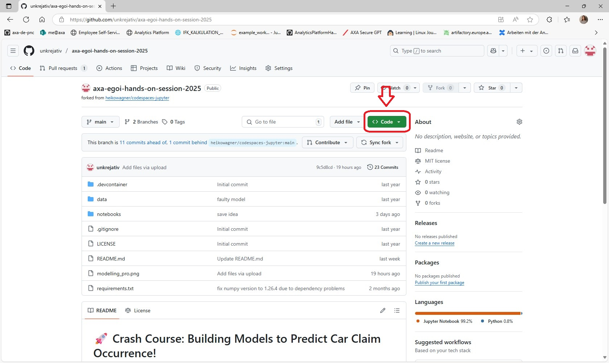
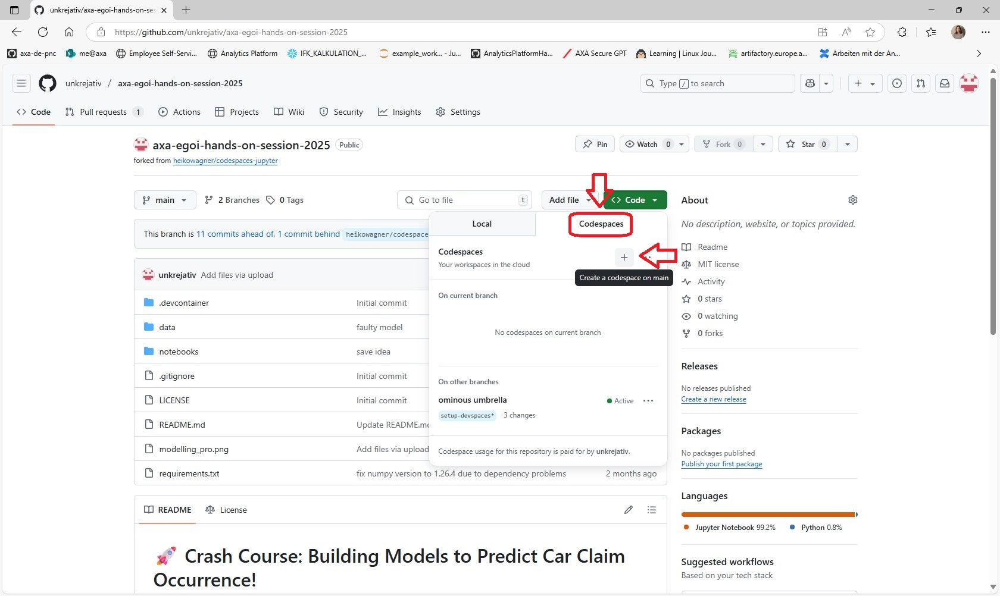
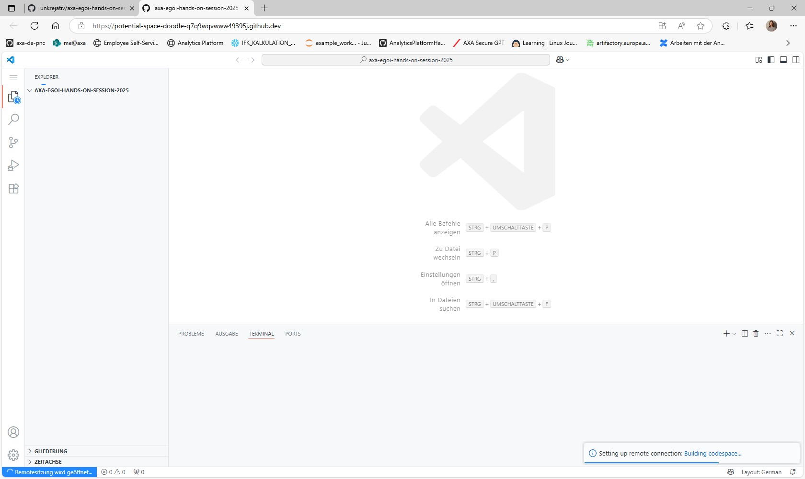

# 🚀 Crash Course: Building Models to Predict Car Claim Occurrence! 

Welcome to the hands-on session of AXA Insurance Group at EGOI 2025. 

The AXA Insurance Group is one of the largest insurance companies in the world, providing several services such as health insurance, car insurance and even insurances for companies to its customers.

Sonja & Reja, data engineer and data scientist at AXA, will guide you through this Coding Challenge. ⭐

💼 Follow us on LinkedIn: 

[🔗 Sonja ](https://www.linkedin.com/in/sonja-pins-456836b4/?originalSubdomain=de)

[🔗 Reja ](https://www.linkedin.com/in/reja-ladwig-8090141a5/?original_referer=https%3A%2F%2Fwww%2Egoogle%2Ecom%2F&originalSubdomain=de)

## 📖 Overview
In this challenge you will collaborate in teams to build a predictive model that determines how high a car damage claim will be, if it might occur.

Your goal is to use your Python coding skills to:
1) analyze and manipulate the data
2) build the most effective model possible
   
via GitHub Codespaces.

The team with the best performing model will be declared the winner!

Together, you will find out what affects the level of car damage, how to visualize your results effectively, and learn about the work of our data scientists at AXA.

**Hints**: During the Challenge our *Modelling-Sis*  will provide some Hints for you, if needed.

## Rating Procedure

1. Sign in to this Mentimeter poll: 

 

   

2) Count your points for section 1, send us your team number and your points on Mentimeter.
3) Count your points for section 2, send us your lowest MSE and the variables of the formula you used in your best model on Mentimeter.
4) We will count all points and announce the winner. 🎉

| Team | Points |
|------------|-------|
| ⭐ 1 |  |
| 👽 2 |  |
| 😺 3 |  |
| ❄️ 4 |  |
| ☀️ 5 |  |
| 💥 6 |  |
| 🐝 7 |  |
| 🍀 8 |  |
| 🌼 9 |  |
| 🎡 10|  |
| 🚗 11|  |
| 🎭 12|  |

## 🛠️ Setting Up the Environment

**Notice**: If you already had a GitHub Account and provided some payment information, please inform us.

<em>1. Step: </em> 

 
Search for the repository <strong>https://github.com/unkrejativ/axa-egoi-hands-on-session-2025</strong> and open it.

<em>2. Step: </em> 

 
Select <strong>Code</strong>:
 
 

   
 
 
click on <strong>Codespaces</strong> and the <strong>+</strong> under <strong>Codespaces</strong>:
 
 

<em>3. Step: </em> 

 
Now you created a new <strong>Codespace</strong> in a new Window and will see: 
 
 

 
 
Wait until the Codespace is configured, this will take around <strong>5 Minutes</strong>.

<em>4. Step: </em> 

 

Bild wenn es fertig ist + neues Terminal?

## 📊 1) Data Overview and Manipulation

First you should get an overview of the preserved data. 

After this you should understand which variables are contained in our dataset and even have a first idea which variables you would like to use for modelling.

Like our data scientist at AXA you will experience that the received data is not clean or prepared for modelling. 

In this section you will prepare your dataset so it can be used for the second part, the modelling part.

Path to the Notebook: *notebooks/1_data_preparation.ipynb*

## 🏆 2) Model Training

Now the modelling begins! 

After understanding the data try to find the best model for ClaimAmount by asking yourself which information will have the biggest impact on the amount of a car damage. 

Discuss with your team which features you would like to use and change or add them to the code. You can try several different models, just copy the received code and change the model formula. 

 **Hint**: A model with all possible variables will not lead to the best model.

We will measure the quality of the model using the Mean Squared Error (MSE). Try to get the **lowest** Mean Squared Error possible!

Path to the Notebook: *notebooks/2_modelling.ipynb*

## ❓ FAQ

<em>What if we have a question or are stuck during the challenge?</em> 

 

Please don't hesitate to ask us at any time or have a look in the FAQ or hints that <em>Modelling-Sis</em>  will give you.

 

<em>Why do I need a coding environment?</em> 

 

An coding environment is important because it allows us to use pre-written functions we need for our projects, so we don't have to write these functions by ourself. These functions are collected in packages and an environment contains several packages. 

Two of the most important packages are pandas, which helps us manipulate and analyze data, and scikit-learn (sklearn), which provides tools for modeling and machine learning.

<em>What is a model?</em> 

 

A model is a simplified representation that helps us understand and predict things. For example, we can use a model to predict the height of a damage after an car accident.

By analyzing past data, we can see how factors like speed or vehicle power affect the height of the damage and train a model with this information. The model learns the relationship between these factors and the height of damage during training.

When we now apply the model, which has been trained on known old data, to new data, we can make predictions about the future. ✨

The easist model is a simple linear regression with Y = c + a*X, where Y is the variable to predict and X is the predictor. This model has only one predictor but you can extend it to any amount of variables.

In insurance, Generalized Linear Models (GLMs) are a common concept used for making predictions.

<em>Why do I have to split the data in train and test data?</em> 

 
The training data is used to train the model, allowing it to learn the patterns and relationships in the data. On the other side the test data is used to evaluate how well the model performs on unseen data, ensuring it can generalize beyond the training set.

<em>What is the Mean Squared Error (MSE)?</em> 

 

A The Mean Squared Error (MSE) is a way to measure how well a model is performing, especially in predicting values. It tells us how close the predicted values are to the actual values. 
Mathematically, the MSE is the mean of the squared differences between the predicted values and the observed values.

<em>What function is used to train the model?</em> 

 

 The function <em>train_evaluate_and_visualize_model</em> is used for fitting a model (estimating the coefficients of a model), visualization and capturing the created models to get an overview. 

For model fitting it uses the package statsmodels and formulates a glm and fits it:

model = smf.glm(formula, data=train, family=sm.families.Gamma(link=sm.families.links.Log()))

results = model.fit()

<em>How to read the model formula and what are non linear extensions?</em> 

 

 
The model formula shows how the variable we want to predict (like ClaimAmount) depends on other variables (called predictors). For example, ClaimAmount ~ variable1 + variable2 means that ClaimAmount is predicted based on variable1 and variable2.

In a simple linear model, we assume that the relationship between the one single predictor and ClaimAmount is a straight line: *ClaimAmount = c + a* * *variable1 + b* * *variable2*
For example, if variable1 increases by 1 unit, ClaimAmount is expected to increase or decrease by a fixed amount (the coefficient a). This means the effect of variable1 on ClaimAmount is constant, no matter the value of variable1 or other variables.

But, real-world data can be more complex, with relationships that aren't straight lines. To capture these more complicated patterns, we can extend the model in different ways:

**Adding powers (like variable1^2)**: This allows the relationship to curve, so the effect of variable1 on ClaimAmount can change at different levels. This extension is useful with continuous variables (numeric data that can take any value, like age).

**Using functions like np.exp() or np.log()**: log(variable1) is useful when the effect gets smaller as the value gets bigger, like with income or age. The exp (exponential) function is used when things grow very fast, like populations or money. Both are mainly used with numbers, not categories like region.

**Interactions (like variable1 * variable2)**: This models the combined effect of two variables, where the effect of one variable depends on the level of another. Interactions are typically used with continuous variables, but they can also be applied to categorical variables (like region or VehBrand). For example, the effect of age (continuous) might differ depending on the VehBrand or VehPower.

<em>Why is a model with all variables not the best?</em> 

 

Using all variables might seem helpful, but it can lead to overfitting, meaning the model learns not only the true patterns but also random noise in the training data. This makes the model perform poorly on new (test) data. On the other hand some variables might not truly affect ClaimAmount, and on top including correlated variables can cause instability and confusion about their effects. Choosing only the most important and independent variables helps create a simpler model that works better on unseen data.

<em>What are residuals?</em> 

 

Residuals are the differences between the actual ClaimAmount and the predicted ClaimAmount from the model. A positive residual means the prediction was lower than the actual ClaimAmount (the model underestimated), while a negative residual means the prediction was higher than the actual (the model overestimated). A good model should have residuals scattered randomly around zero, meaning the predictions are close to the real values and the residuals are mostly near the zero line. This indicates the model fits the data well without systematic errors.

